# Lumeflow Architecture

Version: runtime/v1 snapshot (generated from repository state on 2026-03-28)
Audience: Lumeflow users integrating with Lumeflow
Scope: cluster architecture, runtime lifecycle semantics, and operational behavior

## 1. Purpose And Scope

Lumeflow is a distributed runtime, and Lumeflow users usually see only a narrow part of it: the control surface.
That is practical for day-to-day usage, but it can be limiting when you need to debug startup latency, reason about cancellation behavior, or understand why a job is accepted but does not start immediately.
This document is written to close that gap.
It explains the internal runtime model that drives cluster behavior.

The guide is intentionally layered.
You should be able to start from an application-level use case, then drill into the exact service interactions, data model constraints, and lifecycle transitions that make the behavior predictable.
The goal is for Lumeflow users and platform engineers to be able to design around Lumeflow semantics without reverse-engineering implementation details from source code.

This document explains the system architecture that turns a submitted directed graph into running operators and message flow.

This is intentionally not just an endpoint reference.
It is an end-to-end runtime model with explicit state transitions, dependency boundaries, and operational responsibilities.
You can use it as both an onboarding document and a production operations reference.

Lumeflow deployments are organized as Lumeflow clusters.
A cluster is typically deployed as a Kubernetes environment that hosts the core control-plane services required to accept, schedule, launch, and supervise jobs.
Local development is commonly done with Minikube-based local clusters, while production clusters are expected to be cloud-hosted and production-grade.

A key architectural point is that operator workloads are not executed inside the control-plane pods.
In-cluster services allocate and manage execution resources outside the control-plane Kubernetes processes, typically through executor backends that run operators and sidecars on external compute.
Lumeflow users generally interact directly with Flow Server, but Flow Server is orchestrating these dependencies on your behalf.

## 2. Reader Guide

If you want a quick path:

1. Read Section 3 (core concepts).
2. Read Section 4 (topology and major components).
3. Read Section 6 (job lifecycle).
4. Read Section 8 (sidecar architecture).
5. Read Section 10 (synchronous bridge architecture).

If you are implementing operators, also read Section 8 (sidecar architecture) and Section 9 (message model).

## 3. Core Concepts

### 3.1 Cluster

A Lumeflow cluster is a deployment of cooperating runtime services:

- Flow Server (`flow-server`): Flow Server is the control-plane entrypoint and orchestration brain. It accepts jobs, coordinates job creation and launch, tracks lifecycle status, and drives cancellation/teardown workflows through peer services.
- OpNet Server (`opnet-server`): OpNet Server manages Lumeflow's durable connectivity substrate. It provisions controllers, links, and node connectivity so directed-graph edges become concrete runtime channels.
- Executor Controller (`executor-controller`): Executor Controller manages executor lifecycle and workload launch. It is responsible for creating execution slots, launching operator workloads, reporting status, and tearing workloads down.
- Config Query Server (`config-query-server`): Config Query is a read-only configuration authority for cluster services. It provides validated configuration keys used during bootstrap, bridge discovery, endpoint wiring, and operational policy lookup.
- Sidecar CAS (`sidecar-cas`): Sidecar CAS is a read-only content-addressed artifact service. It provides sidecar payload references and payload retrieval so launches use immutable, deterministic artifacts.
- [Optional] RPC OpNet Bridge replicas (`rpc-opnet-bridge`): RPC bridge replicas provide high-availability request/response adaptation for synchronous jobs. They inject requests into directed-graph ingress and collect egress responses with replica coordination and failover behavior.
- Database: all in-cluster services rely on persistent state. Local clusters usually use in-memory databases for fast development loops, while cloud clusters typically use durable CockroachDB deployments.

In practical terms, this cluster is the full runtime control plane for a set of directed-graph jobs.
Flow Server exposes the Lumeflow user API, but job execution semantics depend on all of these peers being reachable and healthy.
The services are intentionally split so that scheduling, network substrate management, config publication, artifact lookup, and bridge orchestration can evolve independently.

All services running inside the cluster need a database.
Local Lumeflow clusters use in-memory database configurations for fast bring-up and iteration, while cloud-based clusters rely on durable CockroachDB instances for persistence and restart continuity.
An important consequence is that local clusters lose historical job state when torn down, while cloud clusters can retain historical run data across restarts and rollouts.

Although these services run in-cluster, the actual operator code path is externalized through executor lifecycle management.
That separation is important: control-plane service availability and operator compute placement are coupled by APIs, not by in-process runtime embedding.

### 3.2 Job

A job is one submitted directed-graph instance.
It is identified by `job_id`.
Its lifecycle is managed by Flow Server state in CRDB.
You can think of a job as the durable contract between your control client and the cluster: once accepted, it can be queried, started, cancelled, and audited through status transitions.

### 3.3 Directed Graph (DG)

A directed graph (DG) describes:

- operators (name, image, ports, instance policy)
- links (source operator/port, destination operator/port, payload type, link type)

The DG is both a topology and a policy document.
It tells Lumeflow what to run, how nodes are connected, and what payload semantics should be enforced at boundaries.
`instance policy` sets how many operator instances are launched for that job.
Current runtime behavior is fixed-at-launch instance counts; dynamic horizontal scaling after start is not currently supported.

### 3.4 Operator

An operator is user logic packaged in an OCI (Docker-compatible) image and hosted through a sidecar.
Lumeflow users implement operators by subclassing the Python `Operator` base class.
Operators are where business semantics live, while Lumeflow runtime services provide orchestration, connectivity, and lifecycle guarantees around those operator processes.

### 3.5 Port

A port is an operator endpoint.
Port direction semantics are:

- `INGRESS`: receives data from upstream operators or external injection paths.
- `EGRESS`: publishes data to downstream operators or external collection paths.

Port direction is not only documentation; it drives validation and link-shape legality.
For example, each operator should expose at least one `INGRESS` port and one `EGRESS` port, and each link must connect one egress port to one ingress port with compatible payload type metadata.
Mislabeling port direction is one of the most common causes of directed-graph validation errors.

The DAG's external entry and exit points are declared via `dag_ingress` and `dag_egress` fields on the `Dag` message (each is an `OperatorPortIdentifier` naming an operator and port). The flow server uses these to classify ports internally for bridge and injection routing — callers do not need to set bridge-specific port directions.

### 3.6 Link Types

- `REGULAR`: one producer and one consumer
- `SYNC_INJECTOR`: external ingress into a sync graph entry point (use with `graph_type=SYNC`)
- `ASYNC_INJECTOR`: external ingress into an async graph entry point (use with `graph_type=ASYNC`)
- `SYNC_RETRIEVER`: external egress from a sync graph output

Choosing the right link type is what determines whether traffic enters from external producers, flows internally between operators, or exits through bridge-compatible egress paths.

### 3.7 Graph Type and Synchronous vs Asynchronous Job Type

Each DAG carries an explicit `graph_type` field (`SYNC` or `ASYNC`). The flow server enforces that link types are consistent with the declared graph type:

- Synchronous graph (`graph_type=SYNC`):
  - `app_id` is present
  - exactly one `SYNC_INJECTOR` link
  - exactly one `SYNC_RETRIEVER` link
- Asynchronous graph (`graph_type=ASYNC`):
  - uses `ASYNC_INJECTOR` for external injection
  - `SYNC_RETRIEVER` links are not allowed
  - external injection also possible via `InjectMessage` once STARTED

This distinction is foundational for Lumeflow user API design.
Synchronous jobs are built around request/response expectations, while asynchronous jobs are built around eventual downstream processing.

### 3.8 OpNet Substrate

OpNet is the connectivity and health-monitoring mesh that acts as the nervous system of Lumeflow jobs.
OpNet is an API layer and can have multiple concrete implementations.
OpNet substrate defines that concrete implementation for a cluster, and control-plane components must agree on it.
This is one reason Lumeflow can keep a stable high-level architecture and API while adapting to different environments by swapping substrate-specific components.
Current examples include gRPC-based and GCP Pub/Sub-based OpNet substrates.

## 4. Architecture Overview

This section gives the systems view before diving into API-level detail.
The diagrams are intended to answer two questions quickly:
first, which services participate in each Lumeflow user operation;
second, where state is persisted versus where work is executed.
When you read later lifecycle sections, map each step back to these topologies.

### 4.1 High-Level Topology

 

  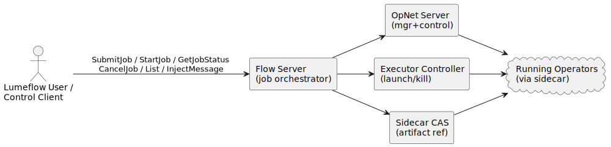

 

Source: [`4_1_high_level_topology.puml`](./diagrams/4_1_high_level_topology.puml)

### 4.2 Typical Cluster Bootstrap Topology

 

  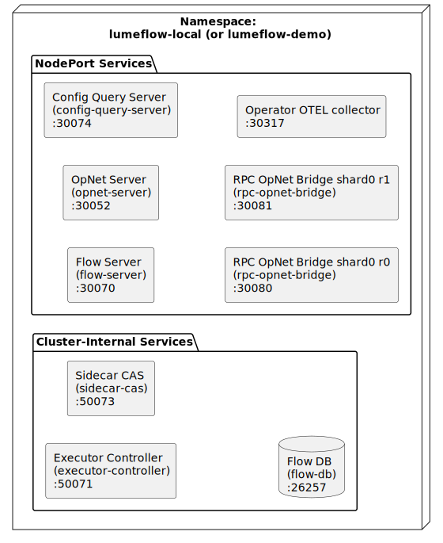

 

Source: [`4_2_cluster_bootstrap_topology_in_demo.puml`](./diagrams/4_2_cluster_bootstrap_topology_in_demo.puml)

### 4.3 Why Multiple Services Exist

Flow Server is intentionally thin in direct execution duties.
It coordinates.
The other services specialize:

- OpNet Server manages controller/link/node abstractions and substrate-specific operations.
- Executor Controller owns executor process/VM lifecycle.
- CAS provides immutable artifact references for operator sidecars.
- Config Query Server provides strongly validated, read-only exported config contract.
- RPC Bridge replicas provide request/response semantics for bridge-enabled synchronous jobs.

This separation lets each subsystem evolve independently while Flow Server keeps Lumeflow user API stable.
It also lets Lumeflow keep a consistent API while replacing substrate-specific components in cloud/platform-specific environments.

## 5. Service Roles In Detail

### 5.1 Flow Server

Flow Server is the orchestration brain of the cluster.
It is the only control-plane API most Lumeflow users need to call directly, and it translates those requests into staged operations across storage, OpNet, and executor services.
Flow Server is also the authority for lifecycle state transitions, so it is the source of truth for what a job currently means operationally (`SUBMITTED`, `CREATED`, `STARTED`, `CANCEL_PENDING`, and terminal statuses).
At a high level, it validates jobs, persists their state, coordinates creation/start/cancel orchestration, and exposes job-facing operations such as submit, status, start, cancel, and async injection.
Longer-term responsibility areas include stronger horizontal scaling behavior and operator-crash healing.

### 5.2 OpNet Server

OpNet is the durable connectivity and control substrate for operators.
OpNet Server manages that substrate for the cluster: it allocates controller state, materializes links, provisions node connectivity, and tracks health signals used by higher-level orchestration logic.
If Flow Server is the scheduler/orchestrator, OpNet Server is the message-fabric and connectivity manager that makes directed-graph edges real.

### 5.3 Executor Controller

Executors are the runtime engines that actually host operator workloads and sidecars.
Executor Controller manages executor lifecycle end-to-end: reservation, launch, status normalization, and teardown.
This service is the boundary between control-plane intent and real compute execution.

It persists executor metadata, launches workloads through configured backend (local or VM path), and maps backend runtime signals to standard status enums.

### 5.4 Config Query Server

Config Query Server is a read-only gRPC API backed by a validated manifest bundle.
It is a control-plane dependency that lets services consume shared configuration without embedding environment-specific constants.
In practice, this service is critical for bridge bootstrap, endpoint resolution, and operational target discovery.

### 5.5 Sidecar CAS

CAS stores runtime artifacts by hash and serves lookup/list/read operations.
It is a read-only artifact authority for sidecar payload resolution and versioned launch references.
This keeps sidecar delivery deterministic across services and avoids ad hoc image or binary lookup behavior inside launch paths.

Flow Server uses it to resolve sidecar launch references matching substrate tags.
Executor Controller uses it to retrieve app payloads for launch.

### 5.6 RPC OpNet Bridge Replicas

RPC OpNet Bridge is the high-availability request/response edge for synchronous Lumeflow jobs.
It maps external RPC-style semantics onto OpNet ingress/egress links and handles replica coordination for delivery and commit behavior.
When Lumeflow users build request/response APIs on top of Lumeflow, these replicas are the primary path between caller traffic and graph execution.

## 6. End-To-End Lifecycle

This lifecycle model is the most important behavior contract for platform integrations.
Most Lumeflow user incidents are not caused by a missing API, but by a mismatch between expected lifecycle timing and actual distributed sequencing.
The sections below make explicit which operations are synchronous, which are asynchronous, and where polling is required.

### 6.1 Lifecycle State Machine

Job status enum includes:

- `JOB_STATUS_UNKNOWN`
- `JOB_STATUS_SUBMITTED`
- `JOB_STATUS_CREATED`
- `JOB_STATUS_READY`
- `JOB_STATUS_STARTED`
- `JOB_STATUS_FINISHED`
- `JOB_STATUS_FAILED`
- `JOB_STATUS_CANCELLED`
- `JOB_STATUS_CANCEL_PENDING`

Observed current runtime behavior:

- primary active path is `SUBMITTED -> CREATED -> STARTED`
- cancellation path is `... -> CANCEL_PENDING -> CANCELLED`
- `READY` is defined in API but not a dominant transition in current code path

Treat these states as orchestration states, not a full per-operator health model.
For example, `STARTED` means launch orchestration completed successfully, not that every business-level condition inside each operator has converged.
If you need deeper readiness semantics, use service-specific health and operator-level signals in addition to Flow status.

State meanings and transition preconditions:

- `JOB_STATUS_UNKNOWN`: placeholder/default value before a durable lifecycle state is set. External callers should not target this as an expected steady state.
- `JOB_STATUS_SUBMITTED`: job row exists and directed-graph payload has been accepted by `SubmitJob`. Preconditions to enter: valid request shape, valid `cluster_id` UUID, directed graph passes validation.
- `JOB_STATUS_CREATED`: create loop has materialized required runtime resources (controller/link/instance metadata). Preconditions to enter: job is claimable by create loop and staged create operations succeed.
- `JOB_STATUS_READY`: enum-defined state reserved for readiness-style flows; currently not a dominant long-lived runtime transition in this implementation.
- `JOB_STATUS_STARTED`: start loop has claimed starter lease and completed launch waves. Preconditions to enter: job is `CREATED`, lease claim succeeds, and operator launches complete without terminal launch error.
- `JOB_STATUS_CANCEL_PENDING`: cancellation requested and accepted for asynchronous teardown. Preconditions to enter: job is in a cancellable non-terminal state and cancel mutation succeeds.
- `JOB_STATUS_CANCELLED`: cancellation finalization has converged. Preconditions to enter: cleanup loop executes teardown/finalization path and marks terminal status.
- `JOB_STATUS_FINISHED`: terminal success state for jobs that complete naturally under their runtime semantics.
- `JOB_STATUS_FAILED`: terminal failure state for non-cancel failure outcomes.

### 6.2 Submit Phase

`SubmitJob` is the contract boundary where a Lumeflow user-provided directed graph becomes durable cluster state.
At this phase, no operator execution is launched yet.
The system is validating model correctness and persisting enough metadata to make later create/start work deterministic and retry-safe.

 

  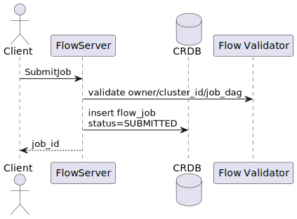

 

Source: [`6_2_submit_phase.puml`](./diagrams/6_2_submit_phase.puml)

Important submit-time checks:

- `owner` must be provided.
- `cluster_id` must be valid UUID string.
- Directed graph must parse and validate via `LumeFlow(...).validate(...)`.
- Job type constraints must match `app_id` and link types.

If submit succeeds, the returned `job_id` is durable identity and should be treated as your canonical handle for all follow-up operations.
Do not infer launch success from submit success; creation and starting are separate lifecycle stages.

### 6.3 Create Loop Phase

Flow Server runs an internal create loop task.
It periodically claims stale `SUBMITTED` rows and `CANCEL_PENDING` rows.

This loop is intentionally asynchronous so API throughput is not coupled to full resource materialization latency.
As a result, the correct Lumeflow user behavior after submit is to poll for progression rather than immediately calling start in a tight loop.

For `SUBMITTED` it runs staged setup:

1. create/reuse OpNet controller
2. persist operators
3. create links and persist link metadata
4. create operator instances/executors
5. mark job `CREATED`

For `CANCEL_PENDING` it runs finalization/teardown and marks `CANCELLED`.

The same periodic loop serving both creation and cancel finalization is why cancellation can appear delayed under heavy submit load.
That is expected behavior unless deployment configuration explicitly allocates independent workers.

### 6.4 Start Phase

Start is explicit RPC (`StartJob`) and requires job in `CREATED`.
Flow Server claims a start lease, loads launch plan, and launches operators level-by-level.

The start lease is a correctness guard against duplicate starters and split-brain launch attempts.
If you see failed-precondition responses around start, it usually indicates lease contention, stale caller assumptions about status, or missing persisted create outputs.

 

  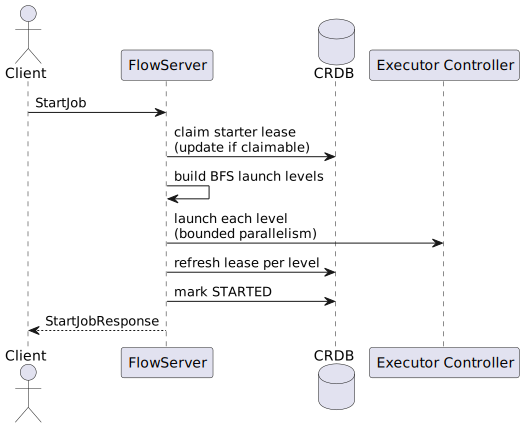

 

Source: [`6_4_start_phase.puml`](./diagrams/6_4_start_phase.puml)

Launch ordering detail:

- Operators are launched BFS by graph depth from entrypoint.
- Operators in same BFS level launch concurrently (bounded by config).
- Lease is refreshed after each level.
- Any launch failure yields gRPC error and prevents marking `STARTED`.

This ordering means graph depth affects startup latency.
Wide levels can launch in parallel, while deep chains enforce serial waves.
Lumeflow users with strict startup timing goals should design directed-graph topology with launch depth in mind.

### 6.5 Run Phase (Message Flow)

Two dominant paths:

- synchronous bridge calls (via rpc bridge)
- asynchronous direct injection (`InjectMessage`)

From a Lumeflow user perspective, these are two different product modes.
Synchronous bridge mode is request/response and usually tied to `app_id`, while asynchronous mode is fire-and-observe and usually tied to external producers.
The graph may look similar in both modes, but ingress/egress contracts and error handling expectations are different.

### 6.6 Cancel Phase

`CancelJob` is request-to-mark operation.
It usually sets `status=CANCEL_PENDING` and stores optional reason.

Cancellation is intentionally split into a fast acknowledgement phase and a slower teardown phase.
That split keeps `CancelJob` responsive under load, but it also means callers must keep polling until terminal status is reached.

Later, create loop finalization does resource teardown:

- clear controller references
- delete operator/link rows
- destroy executors
- destroy OpNet controller resources
- mark job `CANCELLED`

Because external destroy operations are best-effort distributed calls, finalization logic must be idempotent.
Repeated cancel requests are therefore expected to converge, not to produce duplicate destructive behavior.

### 6.7 Teardown Semantics

Cancel finalization is best effort for external destroys.
The runtime still converges job state to `CANCELLED` when finalization path runs.

For Lumeflow user automation, this means the stable contract is status convergence, not guaranteed immediate destruction of every external resource in a single pass.
If your compliance model needs stronger teardown attestations, layer explicit executor/controller inventory checks after cancellation reaches terminal state.

## 7. Dependency Contracts

Although Lumeflow users mainly call Flow Server, understanding these contracts helps explain startup behavior and error surfaces.
A Flow API failure can reflect an upstream dependency contract violation even when the Flow API payload itself is valid.

### 7.1 Config Query Contract

Flow and bridge runtime depend on exported keys.
In demo, contract includes:

- `rpc_bridge.grpc_replicas`
- `cluster.config_service.url`
- `otel.lumeflow_logs_target`
- `otel.operator_logs_target`
- `opnet.operator_target`
- `executor.cartond_target`
- `oci_registry.type`

If these keys are missing or malformed, startup paths fail before operator launch.
For production rollouts, validating config manifests should be part of cluster preflight checks.

### 7.2 CAS Contract

Flow Server resolves sidecar artifact refs by tag family matching (`opnet-sidecar`, substrate-specific tag).
Executor Controller reads artifact payload by hash for launch.

This split is intentional: Flow resolves what to launch; Executor retrieves the launch payload.
If CAS integrity or availability degrades, both create and start flows can be affected differently depending on cache state.

### 7.3 OpNet Contract

Flow Server requires OpNet manager to support:

- `CreateController`
- `CreateLinks`
- `CreateNodes`
- `DestroyControllerResources`
- `InjectMessageIntoLink`

Operator sidecars require OpNet node plugin integration for producer/consumer binding and ack.

From an API consumer perspective, OpNet is an internal dependency.
From an operations perspective, it is the execution fabric for all message movement, so OpNet health is directly tied to data-plane behavior after jobs start.

## 8. Operator Sidecar Architecture (Not Lumeflow user API)

This section is included to help Lumeflow users reason about behavior, not to encourage direct sidecar coupling.
Understanding sidecar responsibilities clarifies why certain operator APIs exist and why stream-level failures appear in specific ways.

### 8.1 Why Sidecar Exists

The sidecar decouples operator application runtime from transport/runtime integration concerns:

- OpNet transport binding
- stream relay and ack behavior
- heartbeat and node registration
- optional container launch wrapper

Without this split, every operator implementation would need to re-implement transport and lifecycle integration concerns.
The sidecar centralizes those concerns so operator code stays focused on business logic.
In practice, sidecars provide data-plane connectivity and operational resilience while exposing an easy-to-consume dispatch/publish interface for operator code.

### 8.2 Sidecar Topology

 

  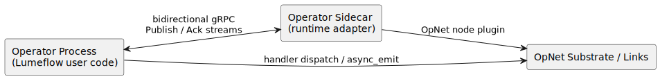

 

Source: [`11_2_sidecar_topology.puml`](./diagrams/11_2_sidecar_topology.puml)

### 8.3 Stream Model

Two gRPC streams are opened between operator and sidecar:

- publish stream
- ack/delivery stream

Sidecar and operator runtime use relay loops for:

- fetching inbound deliveries
- invoking handler dispatch
- forwarding outbound publishes
- propagating ack/nack errors

These relay loops are where backpressure and delivery semantics are enforced.
If you troubleshoot message delays, inspect this stream path in addition to application handler latency.

### 8.4 Heartbeat Model

Sidecar periodically emits OpNet controller heartbeats.
Heartbeat responses may carry result states used for operator/node lifecycle signals.

Heartbeat behavior is a control signal, not application payload flow.
Do not use heartbeat timing as a substitute for business-level success/failure semantics.

## 9. Message Model

The message model is the compatibility contract between producers, operators, sidecars, and bridge paths.
If payload metadata is inconsistent, failures can surface late (at dispatch/unpack time), so strongly typed construction is recommended.

### 9.1 `OpNetMessage`

Fields:

- `message_context`
- `payload_type`
- `payload`

### 9.2 `MessageContext`

Fields:

- `trace_id`
- `bridge_link_refs[]`
- `deadline_ts`

### 9.3 Trace Semantics

`trace_id` is used for end-to-end request correlation.
Bridge runtime uses internal `bridge_trace_id` values mapped onto `trace_id`.

Lumeflow users should preserve trace identifiers through their own observability stack when possible.
That makes it much easier to connect API calls, bridge sessions, and operator logs into a single incident timeline.

### 9.4 Deadline Semantics

`deadline_ts` is carried through message flow.
Bridge and consumer logic may return deadline exceeded result if current time has passed deadline.

Treat deadlines as cooperative constraints.
They are strongest when all producers and consumers in your flow propagate and enforce them consistently.

### 9.5 Payload Type Semantics

`payload_type` is explicit.
This supports typed routing and handler unpack logic.
When bridge request lacks explicit type, bridge runtime may emit custom fallback type metadata.

For production robustness, prefer always setting explicit payload type metadata.
Fallback behavior is useful for compatibility, but explicit typing provides clearer failure diagnostics.

## 10. Synchronous Bridge Architecture

Synchronous bridge mode turns a running directed graph into an RPC-like request/response surface.
This section explains why the bridge exists, how replicas coordinate, and what failover semantics clients should expect.

### 10.1 What Bridge Solves

Flow jobs that act like request/response APIs need:

- ingress mapping by app identity
- response routing to caller
- retries/failover across bridge replicas
- response commit and ack ordering

Bridge provides this over OpNet links plus replica coordination.

Conceptually, the bridge is a protocol adapter: it preserves request/response expectations while the underlying runtime remains message-driven.

### 10.2 Bridge Components

- endpoint client (`RpcOpnetBridgeClient`)
- endpoint service on each replica (`RpcOpnetBridgeEndpointService`)
- peer coordination service (`RpcOpnetBridgePeerService`)
- runtime context resolving replica map and link refs

### 10.3 Bridge Shard Model

- one or more shards
- each shard has one or more replicas
- client chooses shard for request (currently random from shard set)
- client keeps session per shard

Shard-level sessions help spread load and isolate failure domains.
Replica failover within a shard is designed to preserve response retrieval semantics where possible.

### 10.4 Bridge Topology Diagram

 

  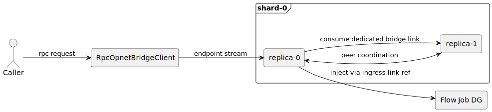

 

Source: [`13_4_bridge_topology_diagram.puml`](./diagrams/13_4_bridge_topology_diagram.puml)

### 10.5 Bridge Request Sequence

 

  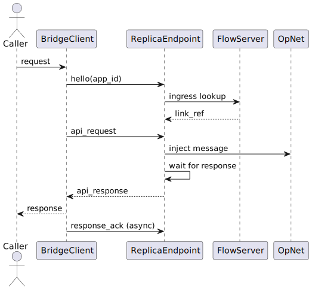

 

Source: [`13_5_bridge_request_sequence.puml`](./diagrams/13_5_bridge_request_sequence.puml)

### 10.6 Bridge Commit Semantics

High-level semantics:

- response delivery to endpoint and endpoint ack define commit progression
- replicas exchange `response_committed` signals
- local message ack is performed when local delivery exists and commit criteria are satisfied

This is why bridge reliability depends on both endpoint delivery and peer coordination.
A response can be produced but still not considered fully committed until replica-level criteria are met.

### 10.7 Bridge Failover Semantics

If active replica connection breaks while waiting:

- client rotates to next replica in shard
- client may fetch response by existing `bridge_trace_id`
- if available, response is returned without replaying external request semantics

Clients should implement failover-aware timeout budgets.
Overly short timeouts can force unnecessary retries and reduce effective availability.

### 10.8 Bridge Config Contract

Bridge replica map is read from config query key:

- `rpc_bridge.grpc_replicas`

Each entry defines:

- `replica_id`
- `shard_index`
- `endpoint_address`

## 11. Asynchronous Injection Architecture

Asynchronous mode is the simplest way to feed long-running flows with external events.
Unlike synchronous bridge mode, there is no request/response completion contract at the ingress call boundary.
`InjectMessage` acknowledges ingestion intent, while downstream outcomes are observed through logs, sinks, or operator outputs.

### 11.1 When To Use InjectMessage

Use `InjectMessage` for jobs submitted without `app_id` (asynchronous mode).

### 11.2 Preconditions

`InjectMessage` checks:

- job exists
- status is `STARTED`
- job type is `ASYNCHRONOUS`
- persisted injector link ref exists

If these checks fail, the caller should usually treat the error as a lifecycle sequencing issue, not a transient transport glitch.

### 11.3 Injection Sequence Diagram

 

  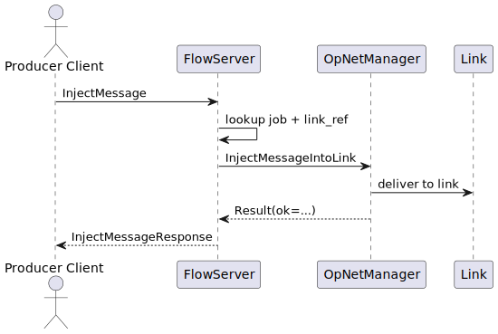

 

Source: [`14_3_injection_sequence_diagram.puml`](./diagrams/14_3_injection_sequence_diagram.puml)

## 12. Job Creation And Launch Internals

This section is architecture detail to help Lumeflow users reason about runtime behavior under load or failure.
It is especially useful when diagnosing why submit succeeded but start is delayed, or why launches fail in bursts under scale.

### 12.1 Create-Flow Stages

For each claimed submitted job:

1. parse + validate directed graph
2. create or reuse OpNet controller
3. persist operator rows
4. create OpNet links and persist link rows
5. persist injector link ref on job row (if injector exists)
6. create executor rows / operator instance rows
7. mark `CREATED`

### 12.2 Link Materialization

Flow Server converts each directed-graph link into an OpNet link via OpNet manager `CreateLinks`.
For injector links, Flow Server persists a resolved `link_ref` for future ingress operations.

Persisting injector references early decouples later ingress API calls from repeated graph traversal and link discovery.

### 12.3 Launch Materialization

Start path obtains:

- substrate
- sidecar artifact hash from CAS tagged by substrate
- operator instance rows with executor ids
- BFS operator order

It then sends `LaunchRequest` per operator instance via Executor Controller.

### 12.4 Parallelism Control

Configurable knobs:

- `start-job-launch-max-parallelism`
- `create-executors-max-parallelism`
- `cancel-job-destroy-max-parallelism`

These controls trade throughput against dependency pressure.
Aggressive parallelism can reduce latency but may increase failure probability when downstream services are near capacity.

### 12.5 Lease And Race Handling

Start path uses `job_starter_id` and `job_starter_ts` lease checks.
Only one starter can claim a `CREATED` job at a time.
Lease is refreshed after each BFS level.

Lease refresh is a practical split-brain prevention mechanism.
If refresh fails unexpectedly, start should abort rather than risk duplicate launch work.

### 12.6 Failure Modes In Start Path

- missing substrate -> failed precondition
- missing operator instance rows -> failed precondition
- CAS sidecar reference missing -> failed precondition
- executor launch unavailable -> unavailable
- lease refresh mismatch -> failed precondition

## 13. Cancellation And Teardown Semantics

Cancellation in distributed systems is a convergence process, not an immediate global stop.
This section documents the contract so callers know which part is synchronous acknowledgement and which part is asynchronous cleanup.

### 13.1 Cancel Request Semantics

`CancelJob` is intentionally fast:

- sets status to `CANCEL_PENDING` for cancellable states
- returns promptly
- deeper teardown is asynchronous

Because the request is fast by design, clients must not assume resources are already gone when the call returns.

### 13.2 Finalization Path

Create loop finalization for `CANCEL_PENDING`:

1. clear controller/substrate references
2. gather executor ids
3. delete operator/link/resource rows
4. destroy executors (best effort, bounded concurrency)
5. destroy OpNet controller resources (if safe)
6. mark `CANCELLED`

Every step should be safe to retry.
Transient dependency errors should delay convergence, not permanently wedge cancellation.

### 13.3 Cancellation Sequence Diagram

 

  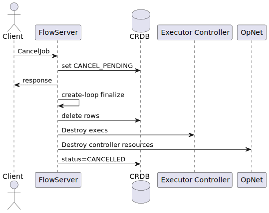

 

Source: [`16_3_cancellation_sequence_diagram.puml`](./diagrams/16_3_cancellation_sequence_diagram.puml)

### 13.4 Lumeflow User Guidance

Because cancel finalization is asynchronous, polling should continue until a terminal status is observed.
For automation pipelines, use bounded polling windows and explicit escalation paths if a job remains `CANCEL_PENDING` longer than your expected operational timeout window.

## 14. Observability And Operations

Observability in Lumeflow spans control-plane services, bridge replicas, and operator workloads.
The runtime emits useful telemetry, but extracting actionable signals requires connecting status progression, launch events, and message-path latency.

### 14.1 Health Probes

Core services expose gRPC health (`liveness`, `readiness`).
Kubernetes manifests use readiness/liveness probes for rollout control.

Readiness should be treated as dependency-aware service availability, not just process up/down.
A green pod with broken downstream dependencies can still produce user-visible failures.

### 14.2 OTEL Logging

Runtime integrates OTEL log endpoints for:

- lumeflow internal service logs
- operator logs (separate target)

### 14.3 Useful Signals For Lumeflow users

- job status progression latency (`SUBMITTED -> CREATED -> STARTED`)
- cancellation convergence (`CANCEL_PENDING -> CANCELLED`)
- launch fanout failures by operator
- bridge response latency and failover counts

These signals are effective because they align with Lumeflow user-observable outcomes.
For example, a large increase in `SUBMITTED -> CREATED` latency usually precedes start-time incidents.

### 14.4 Operational Diagram

 

  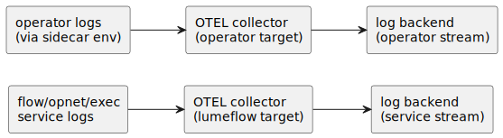

 

Source: [`20_4_operational_diagram.puml`](./diagrams/20_4_operational_diagram.puml)

## 15. Security And Boundary Notes

Security and boundary discipline is what keeps Lumeflow user APIs stable while internals evolve.
This section clarifies what is intended to be consumed directly versus what should be treated as internal plumbing.

### 15.1 API Boundary

Lumeflow user-visible API in this model is Flow Server plus operator base-class API.
Other service APIs are runtime architecture dependencies.

### 15.2 Target Parsing And URI Hygiene

Runtime uses parseTarget conventions for endpoint strings.
Supported forms are constrained to:

- `tcp://host:port`
- `unix:///path`

### 15.3 Registry Credentials

Flow Server can source OCI auth behavior based on config key `oci_registry.type`.
For GCR mode, token fetch path is metadata-server-based in configured environments.

### 15.4 Failure Safety

Many create/start/cancel operations are designed idempotently with DB checks and upsert-like behavior.
Still, Lumeflow users should treat API operations as distributed operations with retry/poll loops.

Idempotency reduces risk, but it does not remove the need for disciplined client behavior.
Use correlation IDs and stable retry policies to avoid creating operational ambiguity during incidents.

## 16. Textbook Sequence Walkthroughs

The sequence walkthroughs below are intended for debugging and implementation reviews.
They provide an end-to-end narrative view that complements the contract tables and API field references.

### 16.1 Full Sync Request Path

 

  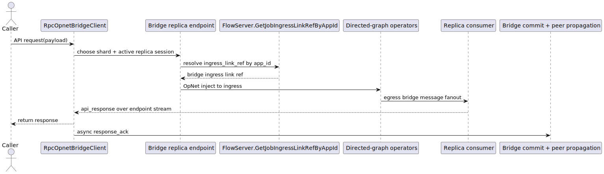

 

Source: [`23_1_full_sync_request_path.puml`](./diagrams/23_1_full_sync_request_path.puml)

### 16.2 Full Async Injection Path

 

  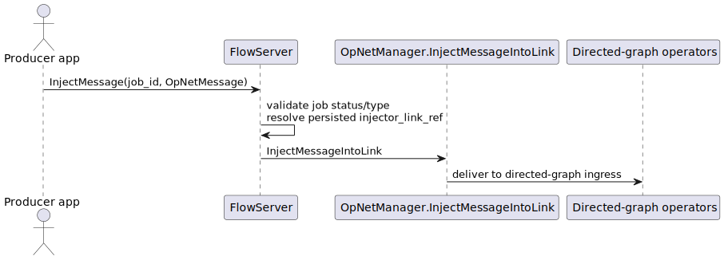

 

Source: [`23_2_full_async_injection_path.puml`](./diagrams/23_2_full_async_injection_path.puml)

### 16.3 Full Cancellation Path

 

  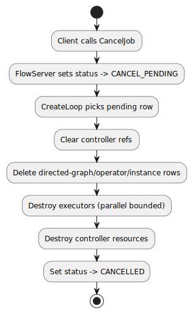

 

Source: [`23_3_full_cancellation_path.puml`](./diagrams/23_3_full_cancellation_path.puml)

## 17. Known Limits And Behavior Notes

This section captures current behavior and boundaries so Lumeflow user teams can design realistic expectations.
If a limitation is material to your use case, treat it as part of the integration contract until a documented runtime change lands.

### 17.1 `Maintain` Is Placeholder

`Maintain` currently responds with `accepted=false` and no extensive maintenance execution.

### 17.2 `READY` Status Presence

`READY` is present in proto enum and conversions, but current dominant operational path is submit/create/start without a stable long-lived `READY` transition.

### 17.3 Terminal Status Coverage

`List` filters out terminal statuses (`FINISHED`, `FAILED`, `CANCELLED`).
Use `GetJobStatus` for explicit terminal inspection of known job ids.

### 17.4 Bridge Dependency Strictness

Sync bridge behavior requires consistent config/service readiness.
If bridge lookup data is absent or mismatched by substrate, bridge helper APIs fail with precondition/unavailable semantics.

### 17.5 Distributed Retry Reality

Client implementations should include retry with jitter for transient unavailability around:

- initial submit/start windows
- dependency startup windows
- bridge session failover paths

Retries should be bounded and observable.
Unlimited blind retries can mask service health regressions and complicate root-cause analysis.

## 18. Lumeflow User Checklist

Use this checklist as a release gate for new flows and major topology changes.
Most avoidable production incidents in distributed orchestration systems come from skipping one of these readiness checks.

### 18.1 Before Submit

- ensure `dag_ingress` is set to the operator/port that receives external input
- ensure `dag_egress` is set for SYNC graphs (identifies bridge output); omit for ASYNC graphs
- ensure link types and direction fields are coherent
- ensure payload type URLs are explicit
- decide sync (`app_id` + `SYNC_INJECTOR`/`SYNC_RETRIEVER` links) vs async (`ASYNC_INJECTOR` link, no `app_id`)

### 18.2 Before Start

- poll until `CREATED`
- ensure dependencies are healthy and reachable (`Flow Server`, `OpNet Server`, `Executor Controller`, `Config Query Server`, `Sidecar CAS`, and `RPC OpNet Bridge` for synchronous jobs)

### 18.3 During Run

- for async jobs, use `InjectMessage`
- for sync jobs, use bridge client path
- monitor status and logs

Include dependency health in your run-time monitoring, not just application logs.

### 18.4 During Teardown

- issue `CancelJob`
- poll until terminal
- validate cleanup in `List`

## 19. Security Considerations (Coming Soon)

This capability is under active development and is not yet part of the stable Lumeflow user API contract.
Identity, attestation, and authorization are critical for most business logic, and especially for agentic workflows where agents can act on behalf of users, systems, or organizations.
Lumeflow is designed to host different agents across different operators, so operator-level identity, attestation, and policy enforcement are core design goals.

### 19.1 Scope and Design Direction

Planned security architecture introduces a dedicated Security Controller trust plane with explicit role boundaries:

- `Flow Server` remains the semantic authority for workload meaning (`cluster`, `app_id`, `operator_name`, `instance_id`).
- `Security Controller` is the credential-issuance and authorization authority.
- `Executor Controller` and `cartond` mediate runtime bootstrap and issuance.
- Operators authenticate as workload identities and are authorized via least-privilege policy.

### 19.2 Trust and Identity Planes

The design uses two identity classes with different trust levels:

- Executor identity:
  - cluster-internal and runtime-facing
  - long-lived relative to operator certs
  - used by Lumeflow-owned runtime code (`cartond`) to bootstrap stronger workload identity
- Operator identity:
  - workload-meaningful identity
  - short-lived
  - used for secret access, delegated cloud-token minting, and future identity-aware data-plane enforcement

 

  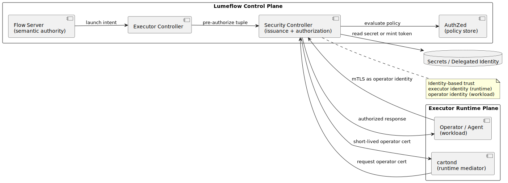

 

Source: [`19_2_security_trust_boundaries.puml`](./diagrams/19_2_security_trust_boundaries.puml)

### 19.3 Attested Issuance and Renewal

Operator certificate issuance is not based on operator self-assertion.
It is issued only after control-plane pre-authorization for a specific executor and workload identity tuple.
Renewal is intentionally mediated by Lumeflow-owned runtime code and gated by proof of existing identity possession.

 

  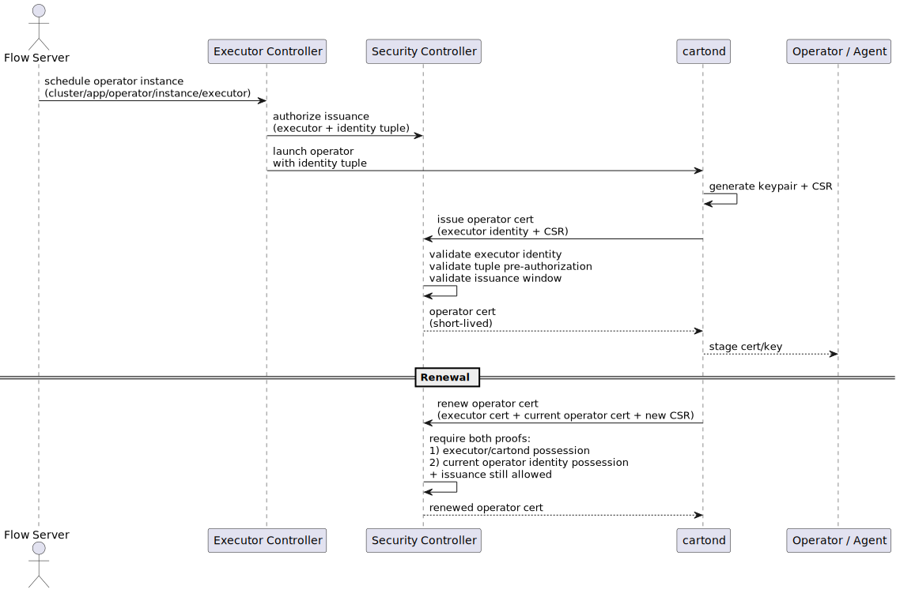

 

Source: [`19_3_security_issuance_and_renewal.puml`](./diagrams/19_3_security_issuance_and_renewal.puml)

### 19.4 Authorization and Delegated Identity

Security policy evaluation is identity-based rather than topology-based.
Planned policy scope targets at least `app_id` and `app_id.operator_name` granularity.
For delegated cloud access, the intended model is short-lived token issuance under policy controls rather than distributing long-lived cloud credentials directly to workloads.

### 19.5 MVP Boundary (Planned)

Initial security rollout is expected to be conservative and fail-closed for new authorization decisions.
Short-lived operator credentials, renewal gating, and stop-issuance controls are central to early behavior.
Additional hardening areas such as broader substrate-level enforcement and revocation-heavy workflows are expected to evolve incrementally.

## 20. Glossary

The glossary is intentionally concise.
It defines terms exactly as used in this document so architecture discussions remain unambiguous across teams.

- `Flow Server`: primary Lumeflow user runtime API endpoint.
- `OpNet`: runtime substrate abstraction for links/ports/messages.
- `Executor`: runtime unit that launches operator-sidecar workload.
- `Sidecar`: transport/runtime adapter hosting streams around operator process.
- `Bridge`: request/response layer for sync jobs over OpNet links.
- `Ingress link ref`: opaque link reference used for external injection.
- `Substrate`: transport mode identifier used by opnet plugin/runtime.
- `BFS launch level`: parallel launch wave ordered by graph depth.
