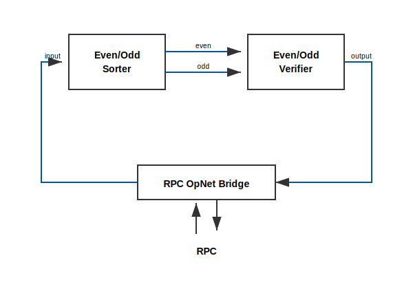

# Lumeflow Local Runtime - Getting Started

This guide is for customers installing Lumeflow local runtime packages from artifact registries (without repository access).

## Requirements

- Debian-based Linux machine (amd64).
- `sudo` access.
- Network access to:
  - Docker apt registry: `https://download.docker.com/linux/ubuntu`
  - Lumesof apt registry: `https://us-central1-apt.pkg.dev/projects/lumesof-sdk-infra`
- Supported and validated OS versions:
  - Ubuntu 24.04 LTS (Noble)
  - Ubuntu 22.04 LTS (Jammy)

## 1) Add Trusted Keys and Apt Sources

Run on the target machine:

This setup script does four things: validates that the host is Ubuntu Jammy or Noble, installs trusted signing keys, adds the Docker and Lumesof apt repositories, and refreshes package metadata with `apt-get update`.

```bash
set -euo pipefail

# Ensure this host is Ubuntu jammy or noble.
source /etc/os-release
if [[ "${ID:-}" != "ubuntu" ]]; then
  echo "Unsupported OS: ${ID:-unknown}. Ubuntu only." >&2
  exit 1
fi
if [[ "${VERSION_CODENAME:-}" != "jammy" && "${VERSION_CODENAME:-}" != "noble" ]]; then
  echo "Unsupported Ubuntu codename: ${VERSION_CODENAME:-unknown}. Expected jammy or noble." >&2
  exit 1
fi

# Docker apt signing key and repo (required by runtime dependency on docker-ce).
sudo install -m 0755 -d /etc/apt/keyrings
curl -fsSL https://download.docker.com/linux/ubuntu/gpg \
  | sudo gpg --dearmor -o /etc/apt/keyrings/docker.gpg
sudo chmod a+r /etc/apt/keyrings/docker.gpg
echo "deb [arch=$(dpkg --print-architecture) signed-by=/etc/apt/keyrings/docker.gpg] https://download.docker.com/linux/ubuntu ${VERSION_CODENAME} stable" \
  | sudo tee /etc/apt/sources.list.d/docker.list >/dev/null

# Lumesof Artifact Registry apt signing key and repo.
curl -fsSL https://us-central1-apt.pkg.dev/doc/repo-signing-key.gpg \
  | sudo gpg --dearmor -o /etc/apt/trusted.gpg.d/artifact-registry.gpg
echo "deb [signed-by=/etc/apt/trusted.gpg.d/artifact-registry.gpg] https://us-central1-apt.pkg.dev/projects/lumesof-sdk-infra sdk-debian-registry main" \
  | sudo tee /etc/apt/sources.list.d/lumesof-sdk.list >/dev/null

sudo apt-get update
```

## 2) Install Lumeflow Local Runtime

```bash
sudo apt-get install -y lumeflow-local-runtime
```

Add your user to the Docker group (required for local runtime workflows):

Lumeflow local runtime launches operators as Docker containers. Because of this, the current user needs permission to access the Docker daemon, which is provided by membership in the `docker` group.

```bash
sudo usermod -aG docker "$USER"
```

Group membership changes do not apply to already-running shell sessions. Log out and log back in (or reconnect over SSH) before continuing, then verify:

```bash
id -nG | tr ' ' '\n' | grep -x docker
```

## 3) Optional: Install Smoke Test Package

This step is optional, but recommended. It verifies that Lumeflow runtime installed correctly, the registries are configured correctly, and the current user has required permissions (especially Docker access).

```bash
sudo apt-get install -y lumeflow-local-smoketest
```

## What the Smoke Test Does

The smoke test validates end-to-end local runtime behavior:

- Starts a fresh local Kubernetes environment (`minikube`).
- Deploys Lumeflow control-plane/data-plane services in namespace `lumeflow-local`.
- Submits an even/odd DAG job to Flow Server.
- Sends 100 random `NumberMessage` requests through the RPC bridge.
- Verifies responses from the verifier operator.
- Cancels the job and reports timings.

### Even/Odd DAG

<p align="center">
  
</p>

How this DAG works:

- The even-odd sorter operator sends even numbers down the `even_out` port and odd numbers down the `odd_out` port.
- The verifier operator receives values on `even_in` and `odd_in`, validates them, and emits an output verdict.
- The RPC OpNet Bridge provides RPC-to-OpNet connectivity by injecting requests into DAG input and returning output verdicts.
- The smoke test injects 100 random numbers via RPC and collects verdicts.
- All verdicts must be `pass`.

## 4) Run the Smoke Test

Recommended sequence:

Heads up: this smoke test usually takes several minutes end-to-end because cluster setup and job lifecycle steps are relatively slow. The RPC request/response validation phase is typically much faster.

```bash
set -euo pipefail
trap 'lumeflow-smoketest --teardown-cluster || true' EXIT

lumeflow-smoketest --start-cluster
lumeflow-smoketest --run-even-odd-dag

trap - EXIT
lumeflow-smoketest --teardown-cluster
```

Expected success signals include:

- Multiple `PASS` lines during request validation.
- Final summary like `SMOKE TEST PASSED`.
- Timing stats for submit/start/RPC/cancel phases.

## Troubleshooting

- If Docker permissions fail, confirm the current shell is a new login session after `usermod -aG docker`.
- If package install is interrupted, run:

```bash
sudo apt-get -f install -y
```

- If cluster startup fails, run teardown and retry:

```bash
lumeflow-smoketest --teardown-cluster
lumeflow-smoketest --start-cluster
```
